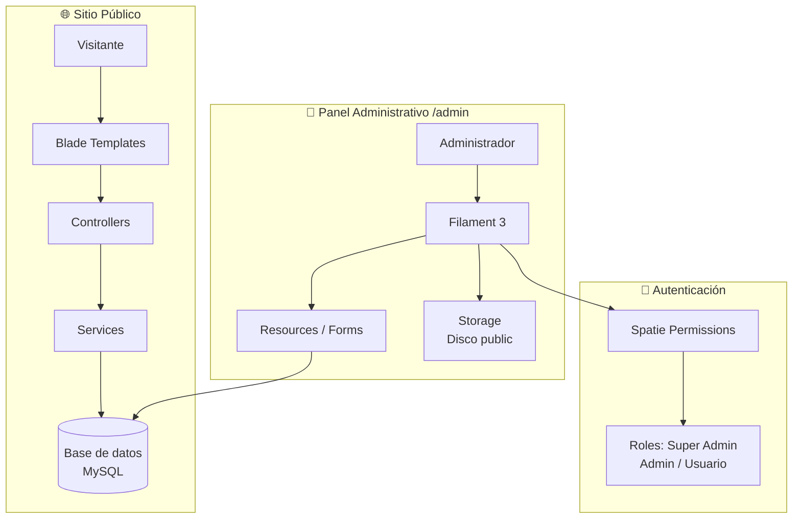
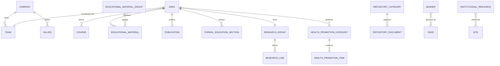
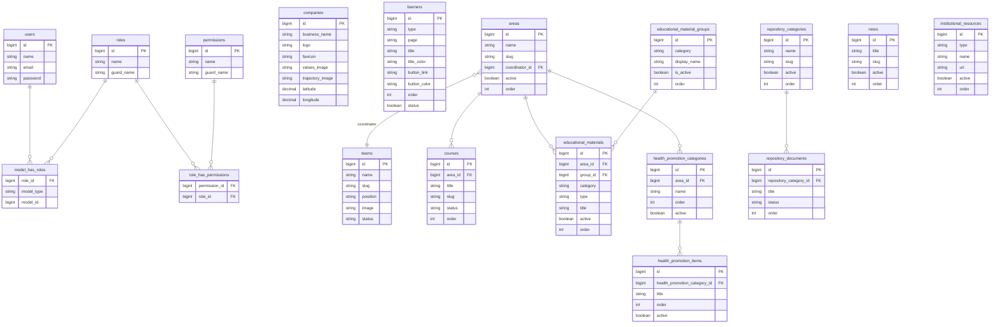
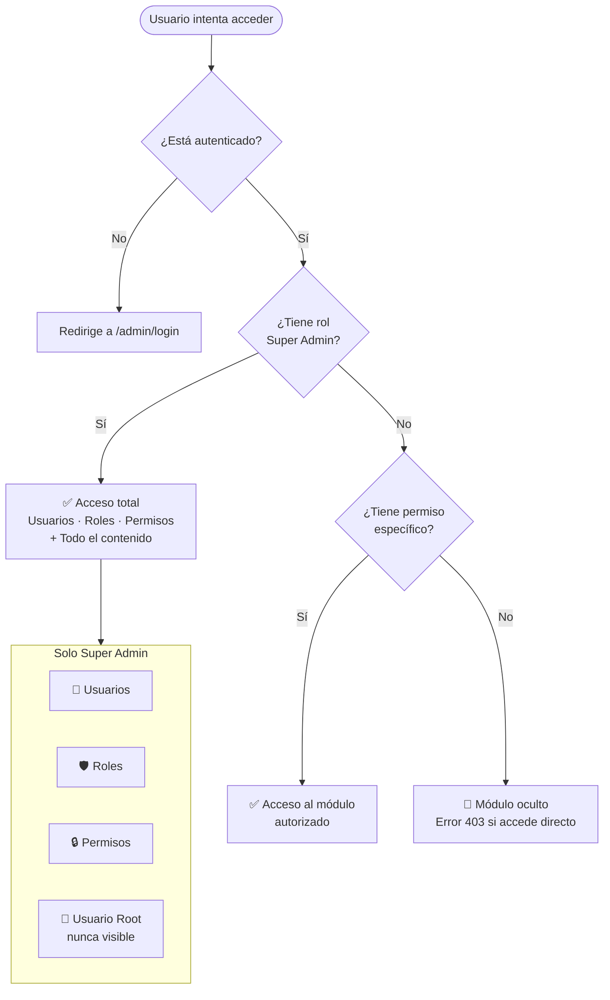
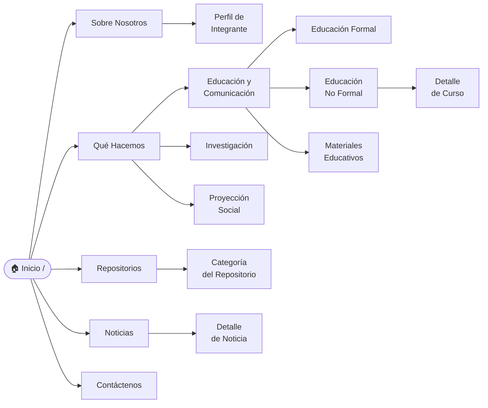

# Instituto Proinapsa — CMS


Sistema de gestión de contenido **(CMS)** para el sitio web institucional del **Instituto Proinapsa**. Desarrollado con **Laravel 11** y el panel administrativo **Filament 3**, centraliza la gestión de todo el contenido del sitio desde un único panel: banners, noticias, áreas de trabajo, cursos, materiales educativos, publicaciones, repositorio de documentos, equipo de trabajo, testimonios, valores y más.

---

## Tabla de contenido

1. [Stack tecnológico](#1-stack-tecnológico)
2. [Requisitos previos](#2-requisitos-previos)
3. [Instalación](#3-instalación)
4. [Configuración del entorno (.env)](#4-configuración-del-entorno-env)
5. [Almacenamiento de archivos](#5-almacenamiento-de-archivos)
6. [Acceso al panel administrativo](#6-acceso-al-panel-administrativo)
7. [Sistema de roles y permisos](#7-sistema-de-roles-y-permisos)
8. [Usuario Root](#8-usuario-root)
9. [Módulos del CMS](#9-módulos-del-cms)
   - [Empresa (Company)](#91-empresa-company)
   - [Banners](#92-banners)
   - [Noticias](#93-noticias)
   - [Equipo de Trabajo (Team)](#94-equipo-de-trabajo-team)
   - [Valores (Values)](#95-valores-values)
   - [Testimonios](#96-testimonios)
   - [Tarjetas de Inicio (Home Cards)](#97-tarjetas-de-inicio-home-cards)
   - [Recursos Institucionales](#98-recursos-institucionales)
   - [Áreas de Trabajo (Areas)](#99-áreas-de-trabajo-areas)
   - [Educación Formal](#910-educación-formal)
   - [Cursos — Educación No Formal](#911-cursos--educación-no-formal)
   - [Materiales Educativos](#912-materiales-educativos)
   - [Grupos de Materiales Educativos](#913-grupos-de-materiales-educativos)
   - [Publicaciones](#914-publicaciones)
   - [Grupo de Investigación](#915-grupo-de-investigación)
   - [Líneas de Investigación](#916-líneas-de-investigación)
   - [Categorías de Promoción de Salud](#917-categorías-de-promoción-de-salud)
   - [Items de Promoción de Salud](#918-items-de-promoción-de-salud)
   - [Categorías del Repositorio](#919-categorías-del-repositorio)
   - [Documentos del Repositorio](#920-documentos-del-repositorio)
10. [Administración](#10-administración)
    - [Usuarios](#101-usuarios)
    - [Roles](#102-roles)
    - [Permisos](#103-permisos)
11. [Rutas públicas del sitio](#11-rutas-públicas-del-sitio)
12. [Comandos útiles](#12-comandos-útiles)
13. [Estructura de directorios](#13-estructura-de-directorios)
14. [Reglas de negocio importantes](#14-reglas-de-negocio-importantes)
15. [Diagramas del sistema](#15-diagramas-del-sistema)
    - [Arquitectura general](#151-arquitectura-general)
    - [Relaciones entre módulos](#152-relaciones-entre-módulos)
    - [Diagrama de base de datos](#153-diagrama-de-base-de-datos)
    - [Flujo de roles y permisos](#154-flujo-de-roles-y-permisos)
    - [Flujo de navegación del sitio público](#155-flujo-de-navegación-del-sitio-público)
16. [Tutoriales paso a paso](#16-tutoriales-paso-a-paso)
    - [Cómo crear un banner principal](#161-cómo-crear-un-banner-principal)
    - [Cómo publicar una noticia](#162-cómo-publicar-una-noticia)
    - [Cómo agregar un curso](#163-cómo-agregar-un-curso)
    - [Cómo agregar un integrante del equipo](#164-cómo-agregar-un-integrante-del-equipo)
    - [Cómo crear un nuevo usuario y asignarle rol](#165-cómo-crear-un-nuevo-usuario-y-asignarle-rol)
    - [Cómo subir un documento al repositorio](#166-cómo-subir-un-documento-al-repositorio)
    - [Cómo agregar un material educativo](#167-cómo-agregar-un-material-educativo)

---

## 1. Stack tecnológico

| Capa | Tecnología |
|---|---|
| Backend | PHP 8.2+ / Laravel 11 |
| Panel Admin | Filament 3.x |
| Base de datos | MySQL 8.0+ |
| Autenticación | Laravel Sanctum + Spatie Permissions |
| Frontend | Blade + Owl Carousel + Bootstrap 4 |
| Almacenamiento | Laravel Storage (disco `public`) |
| Editor de texto | TipTap (FilamentTipTap) |

---

## 2. Requisitos previos

- PHP >= 8.2 con extensiones: `pdo_mysql`, `mbstring`, `openssl`, `tokenizer`, `xml`, `ctype`, `json`, `bcmath`, `fileinfo`, `gd`
- Composer >= 2.x
- MySQL >= 8.0
- Node.js >= 18 (solo para compilar assets si es necesario)
- Servidor web: Apache / Nginx / Laravel Valet / `php artisan serve`

---

## 3. Instalación

```bash
# 1. Clonar el repositorio
git clone https://github.com/KevinBecerraP/web-proinapsa.git
cd web-proinapsa

# 2. Instalar dependencias PHP
composer install

# 3. Copiar el archivo de entorno
cp .env.example .env

# 4. Generar la clave de la aplicación
php artisan key:generate

# 5. Configurar la base de datos en .env (ver sección 4)

# 6. Ejecutar migraciones y seeders
php artisan migrate --seed

# 7. Crear el enlace simbólico para almacenamiento público
php artisan storage:link

# 8. Iniciar el servidor de desarrollo
php artisan serve
```

Acceder al panel en: `http://127.0.0.1:8000/admin`

---

## 4. Configuración del entorno (.env)

Variables clave que deben configurarse antes de iniciar:

```env
# URL de la aplicación — sin barra al final
APP_URL=http://127.0.0.1:8000

# Base de datos
DB_CONNECTION=mysql
DB_HOST=127.0.0.1
DB_PORT=3306
DB_DATABASE=web-institute
DB_USERNAME=root
DB_PASSWORD=root

# Almacenamiento — OBLIGATORIO usar "public" para que las imágenes sean visibles
FILESYSTEM_DISK=public
FILAMENT_FILESYSTEM_DISK=public

# Correo (configurar con el proveedor SMTP del cliente en producción)
MAIL_MAILER=smtp
MAIL_HOST=mailpit
MAIL_PORT=1025
MAIL_FROM_ADDRESS=noreply@proinapsa.edu.co
MAIL_FROM_NAME="${APP_NAME}"
```

> **Importante:** `APP_URL` **no debe tener barra al final**. Una barra extra genera URLs dobles (`//storage/...`) en las imágenes.

---

## 5. Almacenamiento de archivos

Todas las imágenes, PDFs y documentos se guardan en `storage/app/public/` y son accesibles en `public/storage/` gracias al enlace simbólico.

```bash
# Crear el enlace simbólico (solo se hace una vez)
php artisan storage:link
```

### Directorios de almacenamiento

| Módulo | Directorio |
|---|---|
| Logos y favicon de empresa | `companies/` |
| Banners del sitio | `banners/` |
| Imágenes de noticias | `news/` |
| Fotos del equipo | `team/` |
| Imágenes de áreas | `areas/` |
| Imágenes de cursos | `courses/` |
| Materiales educativos | `educational-materials/` |
| Publicaciones | `publications/` |
| Repositorio (documentos) | `repository/` |
| Logos de socios/aliados | `partners/logos/` |
| Proyección social | `health-promotion/` |
| Testimonios | `testimonials/` |
| Valores e íconos | `values/` |
| Tarjetas de inicio | `home-cards/` |

> Los archivos anteriores se eliminan automáticamente del disco cuando se actualizan o eliminan registros (limpieza automática en eventos `updating` y `deleting` de los modelos).

---

## 6. Acceso al panel administrativo

**URL:** `http://TU_DOMINIO/admin`

El panel utiliza **Filament 3** con autenticación propia. Solo los usuarios con rol registrado pueden ingresar.

### Credenciales iniciales (seeder)

| Campo | Valor |
|---|---|
| Email | `admin@proinapsa.edu.co` |
| Contraseña | `Admin@12345` |

> **Cambiar la contraseña inmediatamente después del primer login.**

---

## 7. Sistema de roles y permisos

El CMS usa **Spatie Laravel Permission** para control de acceso granular.

### Roles disponibles

| Rol | Descripción |
|---|---|
| **Super Admin** | Acceso total al panel. Puede gestionar usuarios, roles y permisos. Ver sección 8. |
| **Admin** | Acceso a módulos de contenido según permisos asignados. |
| **Usuario** | Acceso restringido. Solo puede ver o editar lo que se le asigne. |

### Permisos por módulo

Los permisos siguen el patrón `{accion}{Modelo}`, por ejemplo:

- `listBanners` / `createBanner` / `editBanner` / `deleteBanner`
- `listCompanies` / `createCompany` / `editCompany` / `deleteCompany`
- Y así para cada módulo del CMS.

> **El rol Super Admin siempre tiene acceso total, independientemente de los permisos individuales.**

### Visibilidad en el panel

| Sección | Quién la ve |
|---|---|
| Usuarios | Solo Super Admin |
| Roles | Solo Super Admin |
| Permisos | Solo Super Admin |
| Resto del contenido | Según permisos asignados al rol |

---

## 8. Usuario Root

El sistema tiene un usuario **Root** protegido que no puede ser eliminado ni modificado por otros administradores.

| Campo | Valor |
|---|---|
| Nombre | Root |
| Email | `kevinbecerram07@gmail.com` |
| Rol | Super Admin |

**Características:**
- No aparece en el listado de usuarios del panel
- No puede ser eliminado (el modelo lanza una excepción si se intenta)
- Tiene acceso total al sistema siempre

### Crear el usuario Root (SQL)

Si necesitas recrear el usuario Root en una nueva instalación, ejecuta en tu gestor de base de datos:

```sql
USE `web-institute`;

-- Generar hash de contraseña con: php artisan tinker --execute="echo bcrypt('TU_CONTRASEÑA');"

INSERT INTO `users` (`name`, `email`, `password`, `email_verified_at`, `created_at`, `updated_at`)
VALUES (
    'Root',
    'kevinbecerram07@gmail.com',
    '$2y$12$HASH_AQUI',
    NOW(), NOW(), NOW()
);

INSERT INTO `model_has_roles` (`role_id`, `model_type`, `model_id`)
VALUES (1, 'App\\Models\\User', LAST_INSERT_ID());
```

---

## 9. Módulos del CMS

### 9.1 Empresa (Company)

**Grupo de navegación:** Institucional | **Límite:** 1 registro único

Gestiona toda la información corporativa del instituto. Este módulo es el corazón del CMS: su información se usa en el encabezado, pie de página, página "Sobre Nosotros" y contacto.

**Secciones del formulario:**

| Sección | Campos |
|---|---|
| Identidad | Razón social, slogan, descripción, logo (PNG/SVG), favicon |
| Contacto | Dirección, hasta 5 teléfonos, hasta 3 correos electrónicos |
| Redes Sociales | Facebook, Instagram, YouTube, X (Twitter), WhatsApp, Threads |
| Multimedia | Link de video institucional, PDF política de privacidad |
| Misión | Título, descripción, imagen |
| Visión | Título, descripción, imagen |
| Trayectoria | Título, descripción, imagen (obligatoria) |
| Metodología | Título, descripción, imagen |
| Valores | Imagen general de los valores (635×627 px, obligatoria) |
| Ubicación | Latitud y longitud para Google Maps |

> Solo se puede crear **1 registro**. Si ya existe, el botón "Crear" desaparece.

---

### 9.2 Banners

**Grupo de navegación:** Contenido Web | **Permiso requerido:** `listBanners`

Gestiona los banners del sitio web. Existen dos tipos:

#### Tipo Principal (`main`)
- Se muestran en la página de **inicio** como slider rotativo
- Se puede crear más de uno; se ordenan manualmente
- Cada banner tiene su propio orden de aparición
- Los **botones de navegación lateral** del slider toman el color del banner activo:
  - Si el banner tiene **link de botón y color de botón** → usa el `button_color`
  - Si el banner **no tiene link** → usa el `title_color`

#### Tipo Secundario (`secondary`)
- Se muestran como cabecera en páginas interiores
- **Solo puede haber un banner por página**
- Al seleccionar la página, el sistema filtra las páginas que ya tienen banner asignado

**Campos del formulario:**

| Campo | Descripción |
|---|---|
| Estado | Activo / Inactivo |
| Tipo | Principal o Secundario |
| Orden | Solo para tipo principal |
| Página | Solo para tipo secundario |
| Título | Texto principal del banner |
| Color del título | Selector de color HEX |
| Subtítulo | Texto secundario (opcional) |
| Color del subtítulo | Selector de color HEX |
| Imagen principal | 1920×960 px (tipo principal) |
| Imagen secundaria | 1920×500 px (tipo secundario) |
| Link del botón | URL de acción (opcional) |
| Color del botón | Color HEX del botón CTA |

**Páginas disponibles para banners secundarios:**

| Clave | Página del sitio |
|---|---|
| `about_us` | Quiénes Somos |
| `what_we_do` | Qué Hacemos |
| `education_communication` | Educación y Comunicación |
| `social_projection` | Proyección Social |
| `research` | Investigación |
| `publications` | Publicaciones |
| `research_group` | Grupo de Investigación |
| `repository` | Repositorios |
| `news` | Noticias |
| `contact_us` | Contáctenos |

---

### 9.3 Noticias

**Grupo de navegación:** Contenido Web | **Ícono:** Periódico

Gestiona las noticias del instituto. Las noticias aparecen en la sección "Noticias" del sitio y también como vista previa en la página de inicio.

**Campos:**

| Campo | Descripción |
|---|---|
| Título | Nombre de la noticia |
| Slug | Se genera automáticamente del título (no editable) |
| Extracto | Resumen corto para listados (máximo 300 caracteres) |
| Imagen | Imagen principal 1200×675 px |
| Contenido | Editor de texto enriquecido (TipTap) |
| Orden | Posición en el listado |
| Activo | Publicada / No publicada |

> El slug se genera automáticamente a partir del título al crear la noticia.

---

### 9.4 Equipo de Trabajo (Team)

**Grupo de navegación:** Institucional

Gestiona los integrantes del equipo del instituto. Los miembros del equipo pueden ser asignados como **coordinadores de un Área** específica.

**Campos:**

| Campo | Descripción |
|---|---|
| Nombre | Nombre completo (debe ser único) |
| Slug | Generado automáticamente del nombre (no editable) |
| Cargo | Posición institucional |
| Profesión | Título académico o profesional |
| Descripción | Breve perfil biográfico |
| Foto | Imagen 393×390 px |
| Estado | Activo / Inactivo |

> El slug se genera del **nombre**, no del cargo. El nombre debe ser único en la base de datos.

---

### 9.5 Valores (Values)

**Grupo de navegación:** Institucional

Lista los valores institucionales del instituto. Cada valor es un ítem individual. La **imagen general** de los valores se configura en el módulo Empresa.

**Campos:**

| Campo | Descripción |
|---|---|
| Título | Nombre del valor |
| Descripción | Texto explicativo |
| Imagen | Ícono o imagen representativa del valor |
| Orden | Posición en el listado |
| Activo | Visible / Oculto |

---

### 9.6 Testimonios

**Grupo de navegación:** Institucional

Opiniones y testimonios de personas sobre el instituto. Aparecen como carrusel en la página de inicio.

**Campos:**

| Campo | Descripción |
|---|---|
| Nombre | Nombre de la persona |
| Contenido | Texto del testimonio (**máximo 200 caracteres**) |
| Imagen | Foto de la persona |
| Estado | Activo / Inactivo |
| Orden | Posición en el carrusel |

---

### 9.7 Tarjetas de Inicio (Home Cards)

**Grupo de navegación:** Institucional

Tarjetas informativas que aparecen en la sección central de la página de inicio, generalmente mostrando las áreas o servicios del instituto.

**Campos:**

| Campo | Descripción |
|---|---|
| Título | Nombre de la tarjeta |
| Descripción | Texto breve |
| Imagen | Imagen de fondo o ilustración |
| Ícono | Ícono representativo |
| Orden | Posición |
| Activo | Visible / Oculto |

---

### 9.8 Recursos Institucionales

**Grupo de navegación:** Institucional | **Límite links de interés:** máximo 10

Gestiona dos tipos de recursos institucionales que aparecen en el sitio:

#### Tipo: Link de Interés
- URLs externas relevantes para el instituto
- **Máximo 10 links** (si se alcanza el límite, la opción desaparece del formulario)
- Campos: Título del link, URL

#### Tipo: Socio / Aliado
- Organizaciones aliadas del instituto
- Sin límite de cantidad
- Campos: Nombre, Logo/Imagen

**La tabla solo muestra:** Orden, Tipo, Estado (activo/inactivo). El detalle se ve al editar.

---

### 9.9 Áreas de Trabajo (Areas)

**Grupo de navegación:** Educación y Comunicación / Investigación / Proyección Social | **Límite:** máximo 3 áreas

Las áreas son las tres divisiones principales del instituto. Cada área tiene su propia sección en el sitio web.

**Áreas predefinidas:**
1. Educación y Comunicación (`slug: educacion-comunicacion`)
2. Investigación (`slug: investigacion`)
3. Proyección Social (`slug: proyeccion-social`)

**Campos:**

| Campo | Descripción |
|---|---|
| Nombre | Nombre del área (solo lectura, no se modifica) |
| Descripción general | Texto introductorio del área |
| Ícono | Ícono del área para el menú |
| Logo | Logo específico del área |
| Imagen | Imagen principal |
| Coordinador | Miembro del equipo asignado como coordinador |
| Educación Formal | Título, descripción, imagen (subnivel) |
| Educación No Formal | Título, descripción, imagen (subnivel) |
| Materiales Educativos | Título, descripción, imagen, color de fondo |
| Estado y Orden | Activo / Inactivo, posición |

> El **slug** del área es fijo y está vinculado a las rutas del sitio. No modificar.

---

### 9.10 Educación Formal

**Grupo:** Educación y Comunicación

Secciones o programas de educación formal que ofrece el instituto. Se muestran en la página de Educación Formal del área de Educación y Comunicación.

**Campos:** Título, descripción, imagen, link, orden, activo. Vinculado al área correspondiente.

---

### 9.11 Cursos — Educación No Formal

**Grupo:** Educación y Comunicación

Cursos, diplomados y programas de formación continua del instituto.

**Campos:**

| Campo | Descripción |
|---|---|
| Título | Nombre del curso |
| Slug | Generado automáticamente del título |
| Descripción corta | Resumen para listado |
| Imagen principal | Portada del curso |
| Descripción completa | Contenido detallado (editor TipTap) |
| Imágenes de galería | Hasta 1 imagen adicional |
| PDF | Documento adjunto (brochure, programa, etc.) |
| Duración | En horas |
| Link de inscripción | URL externa para registrarse |
| Estado | `active` / `finished` / `inactive` |
| Orden | Posición en el listado |

---

### 9.12 Materiales Educativos

**Grupo:** Educación y Comunicación

Recursos digitales (guías, manuales, juegos) organizados por categoría poblacional.

**Campos:**

| Campo | Descripción |
|---|---|
| Sección | Grupo al que pertenece (ver sección 9.13) |
| Tipo | `Guías y Manuales` / `Juegos` |
| Título | Nombre del material |
| Descripción corta | Resumen breve |
| Imagen principal | Portada del material |
| Descripción completa | Editor TipTap |
| Imágenes de galería | Hasta 5 imágenes adicionales |
| PDF | Documento descargable |
| Orden | Dentro del grupo |
| Activo | Visible / Oculto |

---

### 9.13 Grupos de Materiales Educativos

**Grupo:** Educación y Comunicación

Define las 4 categorías (secciones) en que se organizan los materiales educativos. Son fijas y no se deben agregar más.

| Categoría (clave) | Nombre a mostrar |
|---|---|
| `early_childhood` | Primera Infancia |
| `childhood` | Niñez, Adolescencia y Juventud |
| `women` | Mujer |
| `workers` | Trabajadores |

**Solo se puede configurar:** el nombre a mostrar (`display_name`), el estado y el orden. No se modifican las claves de categoría.

> La relación entre los materiales y sus grupos es por **ID de grupo** (`group_id`), no por el nombre de la categoría.

---

### 9.14 Publicaciones

**Grupo:** Investigación

Publicaciones científicas, artículos y documentos académicos del instituto.

**Campos:**

| Campo | Descripción |
|---|---|
| Título | Nombre de la publicación |
| Descripción corta | Resumen |
| Imagen | Portada de la publicación |
| Link externo | URL a la publicación (Google Scholar, repositorio, etc.) |
| Estado | `active` / `inactive` |
| Orden | Posición |

---

### 9.15 Grupo de Investigación

**Grupo:** Investigación | **Singleton:** solo 1 registro permitido

Información sobre el grupo de investigación del instituto. Solo puede existir **un registro**; si ya existe, el botón "Crear" desaparece.

**Campos:** Nombre del grupo, descripción, link externo, estado activo.

---

### 9.16 Líneas de Investigación

**Grupo:** Investigación

Las líneas temáticas del grupo de investigación. Están asociadas directamente al Grupo de Investigación.

**Campos:** Nombre de la línea, descripción, orden, activo.

---

### 9.17 Categorías de Promoción de Salud

**Grupo:** Proyección Social | **Límite:** exactamente 4 categorías

Las 4 categorías poblacionales para el módulo de Proyección Social / Salud.

| Categoría (clave) | Nombre |
|---|---|
| `early_childhood` | Primera Infancia |
| `childhood` | Niñez, Adolescencia y Juventud |
| `women` | Mujer |
| `workers` | Trabajadores |

> Solo se pueden crear las 4 categorías predefinidas. El sistema muestra en el selector de creación únicamente las categorías que aún no existen.

**Campos adicionales:** descripción, imagen (nullable), orden, activo.

---

### 9.18 Items de Promoción de Salud

**Grupo:** Proyección Social

Recursos, campañas o materiales de salud organizados por categoría poblacional.

**Campos:**

| Campo | Descripción |
|---|---|
| Categoría | Selecciona entre las 4 categorías activas |
| Título | Nombre del ítem |
| Descripción corta | Resumen para listado |
| Imagen principal | Imagen del ítem |
| Descripción completa | Editor TipTap |
| Orden | Posición dentro de la categoría |
| Activo | Visible / Oculto |

---

### 9.19 Categorías del Repositorio

**Grupo:** Repositorio

Organiza los documentos del repositorio en categorías temáticas.

**Campos:**

| Campo | Descripción |
|---|---|
| Nombre | Nombre de la categoría |
| Slug | Generado automáticamente |
| Descripción | Texto descriptivo |
| Imagen | Imagen de portada de la categoría |
| Orden | Posición en el listado |
| Activo | Visible / Oculto |

---

### 9.20 Documentos del Repositorio

**Grupo:** Repositorio

Documentos, informes y archivos descargables organizados por categoría.

**Campos:**

| Campo | Descripción |
|---|---|
| Categoría | Categoría a la que pertenece |
| Título | Nombre del documento |
| Autores | Lista de autores |
| Tema | Tema o área temática |
| Descripción | Resumen del documento |
| Imagen | Portada del documento |
| Archivo PDF | Documento descargable |
| Orden | Posición |
| Estado | `active` / `inactive` |

---

## 10. Administración

Sección visible **solo para el rol Super Admin**.

### 10.1 Usuarios

Lista todos los usuarios del sistema (excepto el usuario Root). Desde aquí se puede:

- **Crear** nuevos usuarios con nombre, email y contraseña
- **Asignar roles** a cada usuario
- **Cambiar contraseña** de un usuario existente (no permite usar la misma contraseña actual)
- **Eliminar** usuarios (excepto el Root)

**Validación de contraseña al editar:** El campo "Nueva Contraseña" es opcional. Si se deja vacío, la contraseña no cambia. Si se llena, no puede ser igual a la contraseña actual.

---

### 10.2 Roles

Gestión de roles del sistema. Cada rol puede tener un conjunto de permisos.

**Roles predeterminados:**
- `Super Admin` — Acceso total
- `Admin` — Acceso a contenido según permisos
- `Usuario` — Acceso restringido

Al crear o editar un rol, se pueden seleccionar los permisos mediante una **lista de checkboxes** agrupada por módulo.

---

### 10.3 Permisos

Lista todos los permisos disponibles en el sistema. Los permisos se generaron automáticamente con Spatie Permission y siguen el patrón:

```
{accion}{Modelo}
```

Ejemplos: `createBanner`, `editCourse`, `deletePulication`, `listTeams`

> Normalmente no es necesario modificar los permisos manualmente. Solo se gestionan al asignarlos a roles.

---

## 11. Rutas públicas del sitio

| Ruta | Nombre | Descripción |
|---|---|---|
| `/` | `home` | Página de inicio con slider de banners |
| `/sobre-nosotros` | `about-us` | Quiénes Somos — empresa, equipo, valores |
| `/sobre-nosotros/equipo/{slug}` | `team.show` | Perfil de un integrante del equipo |
| `/que-hacemos` | `what-we-do.index` | Qué Hacemos — áreas del instituto |
| `/que-hacemos/educacion-comunicacion` | `area.educacion-comunicacion` | Área Educación |
| `/que-hacemos/educacion-comunicacion/educacion-formal` | `area.educacion-formal` | Educación Formal |
| `/que-hacemos/educacion-comunicacion/educacion-no-formal` | `area.educacion-no-formal` | Cursos |
| `/que-hacemos/educacion-comunicacion/educacion-no-formal/{slug}` | `course.show` | Detalle de un curso |
| `/que-hacemos/educacion-comunicacion/materiales` | `area.materiales-educacion` | Materiales Educativos |
| `/que-hacemos/investigacion` | `area.investigacion` | Área Investigación |
| `/que-hacemos/proyeccion-social` | `area.proyeccion-social` | Área Proyección Social |
| `/noticias` | `news.index` | Listado de noticias |
| `/noticias/{id}` | `news.show` | Detalle de una noticia |
| `/repositorio` | `repository.index` | Categorías del repositorio |
| `/repositorio/{slug}` | `repository.show` | Documentos de una categoría |
| `/contactanos` | `contact.index` | Contáctenos |

---

## 12. Comandos útiles

```bash
# Iniciar el servidor de desarrollo
php artisan serve

# Ejecutar todas las migraciones pendientes
php artisan migrate

# Revertir y volver a ejecutar todas las migraciones (CUIDADO: borra datos)
php artisan migrate:fresh --seed

# Limpiar caché de configuración
php artisan config:clear

# Limpiar caché de rutas
php artisan route:clear

# Limpiar vistas compiladas
php artisan view:clear

# Limpiar toda la caché
php artisan optimize:clear

# Crear el enlace simbólico de storage
php artisan storage:link

# Generar hash de contraseña
php artisan tinker --execute="echo bcrypt('TU_CONTRASEÑA');"

# Ver todos los permisos registrados
php artisan tinker --execute="echo json_encode(DB::table('permissions')->pluck('name'));"

# Ver todos los roles registrados
php artisan tinker --execute="echo json_encode(DB::table('roles')->get());"
```

---

## 13. Estructura de directorios

```
institutoproinapsa-cms/
├── app/
│   ├── Filament/
│   │   ├── Resources/          # 22 recursos del panel Filament
│   │   │   ├── BannerResource.php
│   │   │   ├── CompanyResource.php
│   │   │   ├── UserResource.php
│   │   │   ├── RoleManagerResource.php
│   │   │   ├── PermissionManagerResource.php
│   │   │   └── ...
│   │   └── Widgets/            # Widgets del dashboard
│   ├── Http/
│   │   └── Controllers/        # Controladores del sitio público
│   ├── Models/                 # 21 modelos Eloquent
│   ├── Providers/
│   │   └── Filament/
│   │       └── AdminPanelProvider.php   # Configuración del panel
│   └── Services/               # 14 servicios de lógica de negocio
├── config/
│   └── filament-spatie-roles-permissions.php
├── database/
│   ├── migrations/             # ~63 migraciones
│   └── seeders/
├── public/
│   ├── css/
│   │   └── proinapsa-admin.css # CSS personalizado del panel admin
│   ├── js/
│   └── storage -> ../storage/app/public  # Enlace simbólico
├── resources/
│   └── views/
│       ├── layouts/
│       │   └── app.blade.php   # Layout principal del sitio
│       ├── components/
│       │   ├── header.blade.php
│       │   └── footer.blade.php
│       ├── pages/              # Vistas de cada sección del sitio
│       └── index.blade.php     # Página de inicio
├── routes/
│   └── web.php
├── storage/
│   └── app/public/             # Archivos subidos por el usuario
└── .env                        # Configuración del entorno
```

---

## 14. Reglas de negocio importantes

| Módulo | Regla |
|---|---|
| **Empresa** | Solo puede existir 1 registro. No se puede crear un segundo. |
| **Áreas** | Máximo 3 áreas. Los slugs son fijos y no deben modificarse. |
| **Grupo de Investigación** | Solo puede existir 1 registro (patrón Singleton). |
| **Banners secundarios** | Solo 1 banner por página. La misma página no puede tener dos banners secundarios. |
| **Links de Interés** | Máximo 10 registros del tipo `interest_link`. |
| **Categorías de Salud** | Exactamente 4 categorías predefinidas. No se pueden agregar más. |
| **Grupos de Materiales** | Exactamente 4 grupos predefinidos. Las claves de categoría son fijas. |
| **Usuario Root** | No puede ser eliminado. No aparece en el listado de usuarios del panel. |
| **Slug del Equipo** | Se genera automáticamente del nombre. El nombre debe ser único. |
| **Testimonios** | Contenido máximo de 200 caracteres. |
| **Contraseña** | Al cambiar contraseña, no puede ser igual a la actual. |
| **Imágenes** | Se eliminan automáticamente del disco al actualizar o eliminar un registro. |
| **Permisos en panel** | Roles, Permisos y Usuarios solo son visibles para el rol Super Admin. |
| **Colores de banners** | Los botones laterales del slider toman el color del banner activo (button_color si hay link, title_color si no). |

---

## 15. Diagramas del sistema

> Los diagramas están en formato **Mermaid**. Se renderizan automáticamente en GitHub, GitLab y editores como VS Code (con extensión Mermaid).

---

### 15.1 Arquitectura general



---

### 15.2 Relaciones entre módulos



---

### 15.3 Diagrama de base de datos



---

### 15.4 Flujo de roles y permisos



---

### 15.5 Flujo de navegación del sitio público



---

## 16. Tutoriales paso a paso

---

### 16.1 Cómo crear un banner principal

> **Objetivo:** Agregar un nuevo banner al slider de la página de inicio.

```
1. Ir a: Panel Admin → Contenido Web → Banners
2. Clic en [+ Nuevo Banner]
3. En la pestaña "Configuración":
   ✅ Activar el toggle "Estado"
   ✅ Seleccionar Tipo: "Principal"
   ✅ Asignar un número de Orden (ej: 1, 2, 3...)
4. En la pestaña "Información del Banner":
   ✅ Escribir el Título principal
   ✅ Elegir color del título (selector HEX)
   ✅ (Opcional) Escribir subtítulo y elegir su color
5. En la pestaña "Imágenes":
   ✅ Subir imagen principal (recomendado: 1920×960 px)
6. En la pestaña "Botón de Acción" (opcional):
   ✅ Ingresar la URL de destino del botón
   ✅ Elegir el color del botón
   💡 El color del botón también se aplicará a las flechas del slider
7. Clic en [Guardar]
```

> **Nota:** Si el banner no tiene link de botón, las flechas del slider tomarán el color del título.

---

### 16.2 Cómo publicar una noticia

> **Objetivo:** Publicar una nueva noticia en el sitio.

```
1. Ir a: Panel Admin → Noticias
2. Clic en [+ Nueva Noticia]
3. Completar los campos:
   ✅ Título (el slug se genera automáticamente)
   ✅ Extracto: resumen breve (máx. 300 caracteres)
   ✅ Imagen: foto principal (recomendado: 1200×675 px)
   ✅ Contenido: usar el editor de texto enriquecido
   ✅ Orden: número de posición en el listado
   ✅ Activo: toggle encendido para publicar
4. Clic en [Guardar]
5. Verificar en el sitio: /noticias
```

---

### 16.3 Cómo agregar un curso

> **Objetivo:** Publicar un nuevo curso de educación no formal.

```
1. Ir a: Panel Admin → Educación y Comunicación → Cursos
2. Clic en [+ Nuevo Curso]
3. Pestaña "Información General":
   ✅ Título del curso
   ✅ Descripción corta (para el listado)
   ✅ Imagen principal (portada)
4. Pestaña "Contenido":
   ✅ Descripción completa (editor TipTap)
   ✅ (Opcional) Imágenes de galería
   ✅ (Opcional) PDF adjunto
5. Pestaña "Configuración":
   ✅ Duración en horas
   ✅ Link de inscripción (URL externa)
   ✅ Estado: active / finished / inactive
   ✅ Orden
6. Clic en [Guardar]
7. Verificar en: /que-hacemos/educacion-comunicacion/educacion-no-formal
```

---

### 16.4 Cómo agregar un integrante del equipo

> **Objetivo:** Agregar un nuevo miembro al equipo institucional.

```
1. Ir a: Panel Admin → Institucional → Equipo de Trabajo
2. Clic en [+ Nuevo Integrante]
3. Completar:
   ✅ Nombre completo (debe ser ÚNICO en el sistema)
   ✅ Cargo institucional
   ✅ Profesión / Título académico
   ✅ Descripción o perfil biográfico
   ✅ Foto (recomendado: 393×390 px, formato cuadrado)
   ✅ Estado: Activo
4. El Slug se genera automáticamente del nombre (no editable)
5. Clic en [Guardar]

💡 Para asignarlo como coordinador de un Área:
   → Ir al módulo Áreas → Editar el área correspondiente
   → En el campo "Coordinador" seleccionar el nombre del integrante
```

---

### 16.5 Cómo crear un nuevo usuario y asignarle rol

> **Objetivo:** Dar acceso al panel a un nuevo colaborador. (Solo Super Admin)

```
1. Ir a: Panel Admin → Administración → Usuarios
2. Clic en [+ Nuevo Usuario]
3. Sección "Información Personal":
   ✅ Nombre completo
   ✅ Correo electrónico (debe ser único)
4. Sección "Seguridad":
   ✅ Contraseña (mínimo 8 caracteres)
   ✅ Confirmar contraseña
5. Sección "Roles y Permisos":
   ✅ Seleccionar el rol: Admin / Usuario / Super Admin
6. Clic en [Guardar]

⚠️ El usuario recibirá acceso inmediato según el rol asignado.

Para cambiar la contraseña de un usuario existente:
1. Ir a Usuarios → Editar usuario
2. Sección "Seguridad" → "Nueva Contraseña"
3. Ingresar la nueva contraseña (no puede ser igual a la actual)
4. Confirmar y Guardar
```

---

### 16.6 Cómo subir un documento al repositorio

> **Objetivo:** Agregar un documento descargable al repositorio institucional.

```
PASO 1 — Verificar que existe la categoría:
1. Ir a: Panel Admin → Repositorio → Categorías del Repositorio
2. Si no existe la categoría adecuada → [+ Nueva Categoría]
   ✅ Nombre, descripción, imagen, orden

PASO 2 — Subir el documento:
1. Ir a: Panel Admin → Repositorio → Documentos del Repositorio
2. Clic en [+ Nuevo Documento]
3. Completar:
   ✅ Categoría (seleccionar de la lista)
   ✅ Título del documento
   ✅ Autores
   ✅ Tema
   ✅ Descripción / resumen
   ✅ Imagen de portada (opcional)
   ✅ Archivo PDF (el documento en sí)
   ✅ Estado: active
   ✅ Orden
4. Clic en [Guardar]
5. Verificar en: /repositorio/{slug-de-categoria}
```

---

### 16.7 Cómo agregar un material educativo

> **Objetivo:** Publicar un nuevo material en la sección de materiales educativos.

```
PASO 1 — Verificar que existe el grupo:
→ Panel Admin → Educación y Comunicación → Grupos de Materiales
→ Deben existir los 4 grupos: Primera Infancia, Niñez, Mujer, Trabajadores

PASO 2 — Crear el material:
1. Ir a: Panel Admin → Educación y Comunicación → Materiales Educativos
2. Clic en [+ Nuevo Material]
3. Pestaña "Clasificación":
   ✅ Sección: elegir el grupo poblacional (Primera Infancia, etc.)
   ✅ Tipo: Guías y Manuales / Juegos
4. Pestaña "Información":
   ✅ Título
   ✅ Descripción corta
   ✅ Imagen principal
5. Pestaña "Contenido":
   ✅ Descripción completa (editor TipTap)
   ✅ Imágenes de galería (hasta 5)
   ✅ PDF descargable
6. Pestaña "Configuración":
   ✅ Orden dentro del grupo
   ✅ Activo: encendido
7. Clic en [Guardar]
5. Verificar en: /que-hacemos/educacion-comunicacion/materiales
```

---

*Documentación generada para uso interno del equipo de desarrollo y administración del Instituto Proinapsa.*
